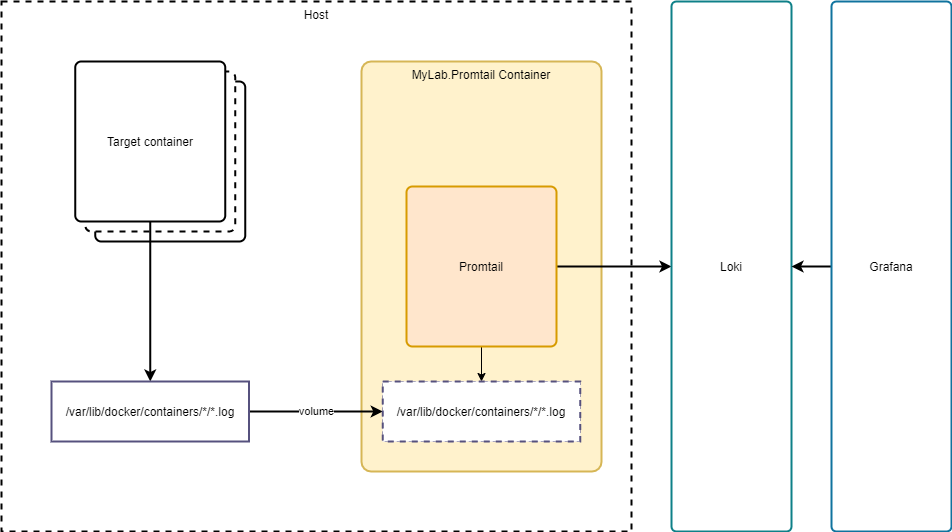
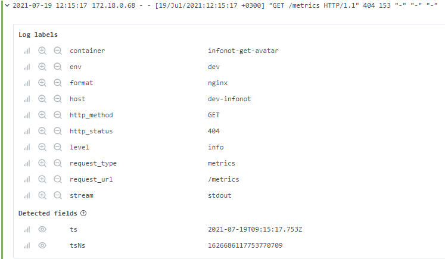
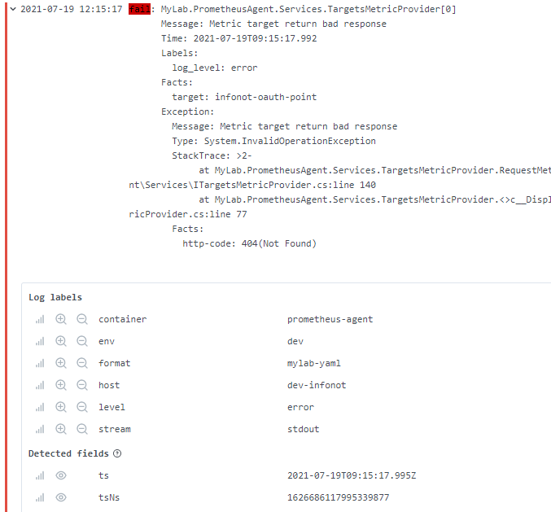

# MyLab.Promtail
[](https://hub.docker.com/r/mylabtools/promtail)

Ознакомьтесь с последними изменениями в [журнале изменений](/changelog.md).

## Обзор

`MyLab.Promtail` - сервис для сбора, обработки и отправки логов из docker-контейнеров в сервис сбора логов [Grafana Loki](https://grafana.com/oss/loki/). Разработан на базе [Promtail](https://grafana.com/docs/loki/latest/clients/promtail/). 

Разворачивается в виде docker-контейнера на сервере с целевыми контейнерами. 



## Настройка

### Настройка хоста

На уровне хоста необходимо настроить опции логирования `docker` контейнеров:

* логирование в `json` файл;
* добавление в логи метки контейнера `log_format`;
* добавление в логи имени контейнера.

Эти настройки хранятся в файле `/etc/docker/daemon.json`:

```json
{
    "log-driver": "json-file",
    "log-opts":{
		"labels": "log_format",
		"tag": "{{.Name}}"
    }
}
```

### Настройка контейнера MyLab.Promtail

При развёртывании контейнера сервиса `MyLab.Promtail` необходимо:

* подключить директорию с контейнерами `/var/lib/docker/containers` хостовой машины в аналогичную директорию в контейнере;
* подключить` volume` `/var/lib/promtail` для хранения состояния считывания файлов логов;
* указать переменную окружения `PROMTAIL_LOKI` - адрес сервиса `Grafana Loki` (без слэша в конце!), например http://192.168.0.1;
* указать переменную окружения `PROMTAIL_ENV` - наименование окружения, например `dev`;
* указать переменную окружения `PROMTAIL_HOST` - наименование хоста, например `primary.mycompany.host`

Пример:

```yaml
version: '3.2'

services:

  promtail:
    container_name: promtail
    image: mylabtools/promtail:0.0.3
    volumes:
      - /var/lib/docker/containers:/var/lib/docker/containers
      - promtail_data:/var/lib/promtail
    environment:
      PROMTAIL_LOKI: http://192.168.0.1/loki
      PROMTAIL_ENV: dev
      PROMTAIL_HOST: dev-infonot
  
volumes:
  promtail_data: {}
```

### Настройки целевого контейнера

Для целевого контейнера, логи которого будет отправлять `MyLab.Promtail`, можно указать формат логов - метка контейнера `log_format`. может принимать следующие значения:

* `nginx`  - логи, которые пишет `nginx`
* `mylab-yaml` - многострочные логи, которые пишут приложения с использованием [MyLab.Log](https://github.com/mylab-log/log) в `yaml` формате.

Если формат не указан, то лог читается как однострочные записи и не подвергаются дополнительному анализу.

### Обработка записей логов

#### Все логи

Для всех логов определяются следующие метки:

*  `container` - имя контейнера. Определяется опцией логирования [`tag`](https://docs.docker.com/config/containers/logging/log_tags/) контейнера;
* `env` - окружение. Определяется переменной окружения `PROMTAIL_ENV`;
* `host` - имя сервера. Определяется переменной окружения `PROMTAIL_HOST`;
* `format` - формат записи лога. Определяется меткой контейнера `log_format`. Поддерживаются следующие значения:
  * `nginx` - логи `nginx`;
  * `mylab-yaml` - логи  [MyLab.Log](https://github.com/mylab-log/log).

#### `nginx`

Пример лога `nginx` в `Grafana`:




Из записи лога протокола запросов определяются следующие метки:

- `level` - уровень записи лога. Возможные значения:
  - `error` - если в записи присутствует один из литералов: `error`|`fail`|`failed`|`fault`|`crash`|`fatal`|`crit`;
  - `warning` - ели в записи присутствует литерал `warn`;
  - `info` - в остальных случаях;
- `http_method` - http метод запроса
- `http_status` - http-код ответа
- `request_type` - определённый тип запроса. Возможные значения:
  - `api` - запрос к API по относительному адресу `/api/...`;
  - `metrics` - запрос метрик по относительному адресу `/metrics`;
  - `other` - другие запросы;
- `request_url` - `URL` запроса.

Для записи ошибки не определяются никакие дополнительные метки.

#### `MyLab.Log`

Пример лога `MyLab.Log` в `Grafana`:



Из записи лога протокола запросов определяются следующие метки:

- `level` - уровень записи лога. Определяется значением метки записи лога `log_level`. Возможны следующие значения: 
  - `debug`;
  - `warning`;
  - `error`.
